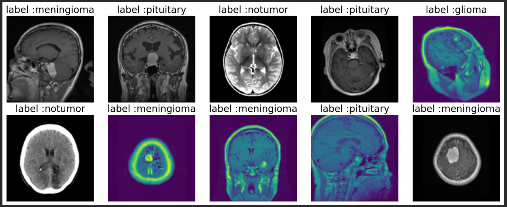

# Brain Tumor Detection — Django + TensorFlow

A Django-based brain-tumor classification application using a trained TensorFlow/VGG16 model. The project includes a browser frontend for image upload, REST API endpoints, model-status checking, optional LangChain explanation support, and local split-RAR model handling.

> **Medical disclaimer:** This project is an educational and research demonstration. It is not a medical diagnostic device. Clinical decisions must always be made by a qualified radiologist or healthcare professional.

## Project preview

Place your application screenshot at:

```
brain-tumor-detection-django/brainscan-preview.png
```

Then this image will appear in the GitHub README:

[](brainscan-preview.png)

If the screenshot is not available yet, create an `assets` folder and add it later. The application itself does not require the screenshot to run.

## Features

The application provides a Django web interface where users can upload a brain-scan image and receive a predicted class, confidence score, class probabilities, and a safety-focused explanation. The backend exposes REST endpoints for prediction and model status, while the frontend is served directly by Django without requiring a separate React or Node.js server.

| Feature | Description |
| --- | --- |
| Image upload | Upload a JPG, JPEG, or PNG brain image from the browser. |
| Prediction | Classifies the image into `notumor`, `glioma`, `meningioma`, or `pituitary`. |
| Confidence | Returns the highest class probability. |
| REST API | Provides prediction and model-status endpoints. |
| Model support | Supports direct `model.h5` or two-part local RAR archives. |
| Frontend | Django template-based upload page with preview and result display. |
| Safety | Includes an educational-use and clinical disclaimer. |

## Model classes

The application expects the same label order used by the supplied Colab notebook:

```python
["notumor", "glioma", "meningioma", "pituitary"]
```

The model uses 128×128 RGB input images, matching the notebook preprocessing configuration.

## Directory structure

```
brain_tumor_api/
├── manage.py
├── requirements.txt
├── README.md
├── .env.example
├── .gitignore
├── config/
│   ├── settings.py
│   ├── urls.py
│   ├── asgi.py
│   └── wsgi.py
├── detector/
│   ├── apps.py
│   ├── urls.py
│   ├── views.py
│   ├── services/
│   │   ├── predictor.py
│   │   ├── model_fetcher.py
│   │   └── chain.py
│   └── templates/
│       └── detector/
│           └── index.html
├── models/
│   ├── model.h5                 # optional; do not commit to GitHub
│   ├── model.part1.rar          # optional split archive part 1
│   └── model.part2.rar          # optional split archive part 2
├── assets/
│   └── brainscan-preview.png    # optional README screenshot
├── media/
└── scripts/
    └── train_model.py
```

## Model placement

Use **one** of the following options.

### Option A: direct model file

Place the trained model here:

```
models/model.h5
```

### Option B: split RAR model

Place both archive parts here:

```
models/model.part1.rar
models/model.part2.rar
```

Do not rename the files unless you also update the configuration. Both parts must remain in the same directory. The application uses 7-Zip to extract the archive when the model is first required.

Large model files and private data should not be committed to GitHub. Keep them locally or use private object storage.

## Installation on Windows

Open PowerShell inside the project folder:

```
cd "C:\path\to\brain_tumor_api"
py -m venv .venv
.\.venv\Scripts\python.exe -m pip install --upgrade pip
.\.venv\Scripts\python.exe -m pip install -r requirements.txt
Copy-Item .env.example .env
.\.venv\Scripts\python.exe manage.py migrate
.\.venv\Scripts\python.exe manage.py runserver 127.0.0.1:8000
```

If you are using split RAR files, install [7-Zip](https://www.7-zip.org/) and make sure `7z.exe` is available in PATH.

## Installation on Linux

```bash
cd /path/to/brain_tumor_api
python3 -m venv .venv
source .venv/bin/activate
python -m pip install --upgrade pip
python -m pip install -r requirements.txt
cp .env.example .env
sudo apt-get update
sudo apt-get install -y p7zip-full
python manage.py migrate
python manage.py runserver 127.0.0.1:8000
```

## Browser frontend

Open the following URL after starting Django:

```
http://127.0.0.1:8000/
```

Upload a supported brain image, select **Analyze image**, and wait for the prediction response. The frontend is located at:

```
detector/templates/detector/index.html
```

## API endpoints

### Health check

```
GET /health/
```

### Model status

```
GET /api/model-status/
```

### Prediction

```
POST /api/predict/
Content-Type: multipart/form-data
```

The upload field must be named `image`.

```bash
curl -X POST http://127.0.0.1:8000/api/predict/ \
  -F "image=@/path/to/brain_scan.jpg"
```

A typical response contains the predicted result, confidence, class probabilities, and explanation. Exact response fields depend on the current view implementation.

## Adding images to the Django frontend

For a frontend screenshot or static visual asset, create this directory:

```
assets/
```

For an image displayed inside a Django template, use the static-files directory instead:

```
static/images/brain-scan-example.png
```

In the template, load static files at the top:

```

```

Then reference the image:

```html

```

For user-uploaded prediction images, use the existing `media/` configuration rather than placing uploads inside `static/`.

## Colab training paths

The original notebook used these Google Drive paths:

```python
train_dir = "/content/drive/MyDrive/Brain_tumar_detection/brain_tumer_dataset/Training"
test_dir = "/content/drive/MyDrive/Brain_tumar_detection/brain_tumer_dataset/Testing"
```

Those paths work inside Google Colab after mounting Google Drive. They do not work directly on a local Windows or Linux machine. If the model is already trained, copy only the resulting model file or its split archive parts into the local `models/` directory.

## GitHub security checklist

Keep the repository private if it contains proprietary code. Do not commit `.env`, API keys, private medical images, `model.h5`, RAR archives, virtual environments, or generated databases. The `.gitignore` should include:

```
.venv/
__pycache__/
*.py[cod]
.env
.env.*
!.env.example
db.sqlite3
media/
models/*.h5
models/*.rar
staticfiles/
```

## GitHub commit message

For the first upload, use:

```
Add Django brain tumor detection app and README
```

Optional description:

```
Added the Django REST API, TensorFlow VGG16 prediction service, browser image-upload frontend, local model configuration, split-RAR support, setup instructions, and project documentation.
```

## License

Add a license only if you have decided how other people may use, modify, and distribute the code. For a private personal project, leaving the license unset is acceptable until that decision is made.
